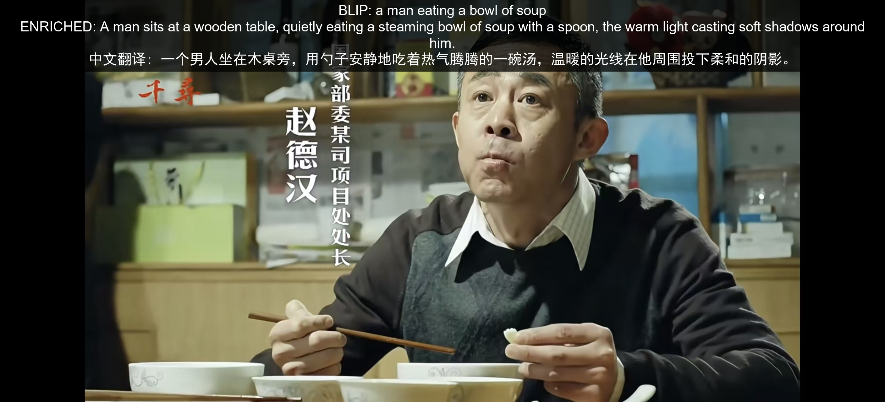

# 图像描述系统 🖼️→📝

**输入一张图片，自动生成中文文字描述，并输出可视化结果。**

---

## 🔥 效果展示

| 输入图片                                                                                                           | 输出结果                  |
|:--------------------------------------------------------------------------------------------------------------:|:---------------------:|
|  |  |

---

## 🧠 原理说明

本项目让计算机"看懂"图片并用中文说出来，核心分两步：

### 第一步：BLIP 看图写英文

使用 Salesforce 的 **BLIP**（Bootstrapping Language-Image Pre-training）模型。它像一个"看过无数图片的 AI"，能识别图片中的物体、场景和关系，生成英文描述。

```
图片 → BLIP 模型 → "a woman dancing in a dance studio"
```

BLIP 的工作原理：

- 把图片切分成小块，提取视觉特征
- 用 Transformer 神经网络（和 ChatGPT 同款架构）将这些特征解码成文字
- 模型在海量（图片，文字描述）配对数据上训练过，所以能识别出图中是什么

### 第二步：MarianMT 翻译中文

BLIP 生成的是英文，再用 **MarianMT**（ Helsinki-NLP 的机器翻译模型）将其翻译成中文。

```
"Zhao Dehan is eating noodles, unaware that he is about to be arrested." → MarianMT → "赵德汉在吃面,还没意识到要被抓了"
```

### 额外优化模块（在 `extensions/` 中）

除了基础流程，本实验还探索了 5 种优化方式：

| 优化方式            | 思路                                    |
| --------------- | ------------------------------------- |
| **束搜索**         | 不只看一个最佳结果，而是同时保留 Top-5 候选路径，选出整体最优的描述 |
| **DeepSeek 翻译** | 用大语言模型（1.5B 参数）替代传统机器翻译，中文表达更自然地道     |
| **YOLO + 分区描述** | 先用 YOLO 检测出图中的每个物体，再对每个区域单独描述，能说出更多细节 |
| **ITM 匹配重排**    | 生成多个候选描述后，用图文匹配模型打分，选出"最贴合图片"的那一个     |
| **GPU 批量加速**    | 同时对多张图片进行推理，利用 GPU 并行计算能力提升速度         |

---

## 🚀 快速开始

```bash
# 1. 安装依赖
pip install transformers torch pillow matplotlib sentencepiece sacremoses

# 2. 放一张图片到 images/ 目录

# 3. 运行核心脚本
python caption.py
```

> 首次运行会自动从 HuggingFace 下载模型（约 1.2GB）。国内用户设镜像加速：
> 
> ```bash
> export HF_ENDPOINT=https://hf-mirror.com
> ```

---

## 📦 完整模块

| 命令                                           | 功能                        |
| -------------------------------------------- | ------------------------- |
| `python caption.py`                          | **✦ 核心功能** — 单张图片推理 + 可视化 |
| `python extensions/batch_caption.py`         | 批量处理所有图片                  |
| `python extensions/caption_beam.py`          | 束搜索优化（Top-3 候选）           |
| `python extensions/caption_translate_llm.py` | DeepSeek 大模型翻译            |
| `python extensions/caption_yolo_region.py`   | YOLO 检测 + 分区描述            |
| `python extensions/caption_retrieval.py`     | ITM 评分重排序                 |
| `python extensions/caption_batch_gpu.py`     | GPU 批量推理对比                |
| `python run_all.py`                          | 一键运行所有模块                  |

---

## 📁 项目结构

```
├── caption.py               ★ 核心：单张图片推理
├── extensions/              扩展模块
│   ├── batch_caption.py      批量处理
│   ├── caption_beam.py       束搜索优化
│   ├── caption_translate_llm.py  DeepSeek 翻译
│   ├── caption_yolo_region.py   YOLO + 分区描述
│   ├── caption_retrieval.py     ITM 匹配重排
│   ├── caption_batch_gpu.py     GPU 批量加速
│   ├── caption_visualize.py     可视化工具
│   └── download_models.py      模型预下载
├── docs/                    文档资料
│   └── 实验流程.md             完整实验指导书
├── run_all.py               一键运行全部
├── images/                  输入图片
├── results/                 输出结果
└── requirements.txt
```

---

## ⚙️ 环境要求

- Python ≥ 3.8
- 支持 CPU 运行（有 GPU 更快）
- 硬盘空间：约 5GB（存放下载的模型）
